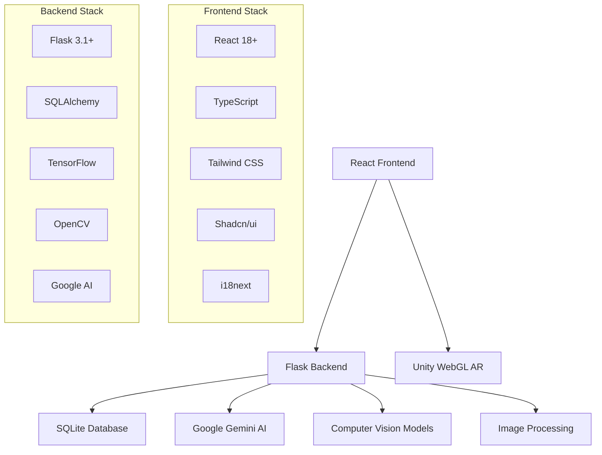

# 🏺 KemetPass - EgGolden Paws is an innovative Egyptian cultural heritage and tourism platform that combines modern web technologies with ancient Egyptian history. Experience Egypt like never before through AR experiences, hieroglyphic translation, AI-powered chatbots, and interactive historical site exploration.ptian Heritage Experience

<div align="center">


<!-- Animated badges -->
[](https://git.io/typing-svg)

[](https://python.org)
[](https://reactjs.org)
[](https://typescriptlang.org)
[](https://flask.palletsprojects.com)
[](https://tailwindcss.com)

</div>

## 🌟 Overview

KemetPass is an innovative Egyptian cultural heritage and tourism platform that combines modern web technologies with ancient Egyptian history. Experience Egypt like never before through AR experiences, hieroglyphic translation, AI-powered chatbots, and interactive historical site exploration.

<details open>
<summary><h2>🎯 Key Features</h2></summary>

### 🔮 AR Experience
- **Unity-powered WebGL**: Immersive augmented reality experiences
- **Historical Reconstruction**: Virtual tours of ancient Egyptian sites
- **Interactive Elements**: Touch and explore ancient artifacts

### 🔤 Hieroglyphic Translator
- **AI-Powered Translation**: Convert hieroglyphics to modern text
- **Machine Learning Model**: Custom Egyptian hieroglyphic classification
- **Real-time Processing**: Upload images and get instant translations

### 🤖 Intelligent Chatbot
- **Google Gemini Integration**: AI-powered cultural assistant
- **Contextual Responses**: Smart answers about Egyptian history
- **Multi-language Support**: Arabic and English interface

### 📍 Location Services
- **Where Am I**: GPS-based historical site identification
- **Who Am I**: Image recognition for historical figures and artifacts
- **Know Me**: Personalized cultural recommendations

### 🌤️ Weather Integration
- **Real-time Weather**: Current conditions for Egyptian cities
- **Travel Planning**: Weather-based tourism recommendations
- **Historical Climate**: Ancient vs. modern weather patterns

### 🗺️ Trip Planner
- **Smart Itineraries**: AI-generated travel plans
- **Historical Routes**: Follow ancient trade paths
- **Cultural Events**: Local festivals and celebrations

</details>

## 🚀 Quick Start

<details>
<summary><h3>📋 Prerequisites</h3></summary>

- **Node.js** 18+ 
- **Python** 3.9+
- **Git**
- **Modern Browser** with WebGL support

</details>

### 🛠️ Installation

```bash
# Clone the repository
git clone https://github.com/mohamedgobaraa/KemetPass-website.git
cd KemetPass-website

# Install frontend dependencies
npm install

# Install backend dependencies
cd backend
pip install -r requirements.txt
```

### 🏃‍♂️ Running the Application

<details>
<summary><b>🎨 Frontend (React + Vite)</b></summary>

```bash
# Development server
npm run dev

# Build for production
npm run build

# Preview production build
npm run preview
```

**Frontend will be available at:** `http://localhost:5173`

</details>

<details>
<summary><b>🔧 Backend (Flask)</b></summary>

```bash
cd backend

# Run Flask development server
python app.py
```

**Backend API will be available at:** `http://localhost:5000`

</details>

## 🏗️ Architecture



## 📁 Project Structure

```
kemetpass/
├── 🎨 src/                      # React frontend
│   ├── components/              # Reusable UI components
│   ├── pages/                   # Application pages
│   ├── hooks/                   # Custom React hooks
│   ├── i18n/                    # Internationalization
│   └── lib/                     # Utility functions
├── 🔧 backend/                  # Flask backend
│   ├── routes/                  # API endpoints
│   ├── models/                  # Database models & ML models
│   ├── utils/                   # Helper functions
│   └── GoldenPaws/             # Unity WebGL build
├── 📦 package.json             # Frontend dependencies
└── 🐍 requirements.txt         # Backend dependencies
```

## 🎯 API Endpoints

<details>
<summary><h3>🔐 Authentication</h3></summary>

| Method | Endpoint | Description |
|--------|----------|-------------|
| `POST` | `/auth/register` | User registration |
| `POST` | `/auth/login` | User login |
| `GET` | `/auth/profile` | Get user profile |
| `PUT` | `/auth/profile` | Update profile |

</details>

<details>
<summary><h3>🔤 Features</h3></summary>

| Method | Endpoint | Description |
|--------|----------|-------------|
| `POST` | `/features/translate` | Hieroglyphic translation |
| `POST` | `/features/where-am-i` | Location identification |
| `POST` | `/features/who-am-i` | Image recognition |
| `POST` | `/features/chatbot` | AI chatbot interaction |

</details>

<details>
<summary><h3>🎮 Game & AR</h3></summary>

| Method | Endpoint | Description |
|--------|----------|-------------|
| `GET` | `/game/leaderboard` | Game leaderboard |
| `POST` | `/game/score` | Submit game score |
| `GET` | `/ar/` | AR experience |

</details>

## 🛡️ Technologies Used

<div align="center">

### Frontend Stack
[](https://reactjs.org)
[](https://typescriptlang.org)
[](https://vitejs.dev)
[](https://tailwindcss.com)

### Backend Stack
[](https://python.org)
[](https://flask.palletsprojects.com)
[](https://tensorflow.org)
[](https://sqlite.org)

### AI & ML
[](https://ai.google)
[](https://opencv.org)

### Game Engine
[](https://unity.com)

</div>

## 🤝 Contributing

We welcome contributions to KemetPass! Here's how you can help:

<details>
<summary><h3>🔧 Development Setup</h3></summary>

1. **Fork** the repository
2. **Clone** your fork
3. **Create** a feature branch
4. **Make** your changes
5. **Test** thoroughly
6. **Submit** a pull request

```bash
git checkout -b feature/amazing-feature
git commit -m 'Add amazing feature'
git push origin feature/amazing-feature
```

</details>

<details>
<summary><h3>📋 Contribution Guidelines</h3></summary>

- Follow existing code style
- Write meaningful commit messages
- Add tests for new features
- Update documentation
- Ensure all tests pass

</details>

## 📄 License

This project is licensed under the **MIT License** - see the [LICENSE](LICENSE) file for details.

## 🏆 Acknowledgments

- **Ancient Egyptian Heritage** - For inspiring this project
- **Google AI** - For Gemini API integration
- **Unity Technologies** - For WebGL AR capabilities
- **Open Source Community** - For amazing libraries and tools

---

<div align="center">

### 📞 Contact & Support

[](mailto:eng.mohamed.gobara@gmail.com)
[](https://github.com/mohamedgobaraa/KemetPass-website)
[](https://github.com/mohamedgobaraa/KemetPass-website#readme)

**Made with ❤️ for Egyptian Cultural Heritage**


</div>

<!-- Animated footer -->
<div align="center">
  
</div>
